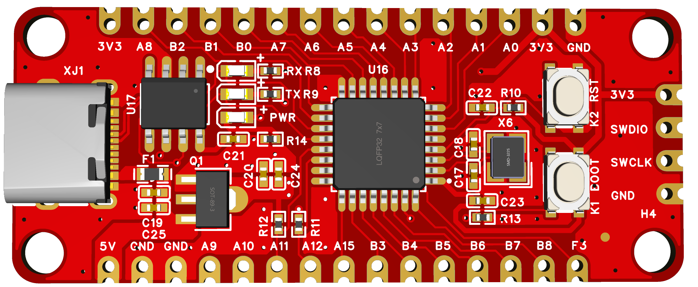
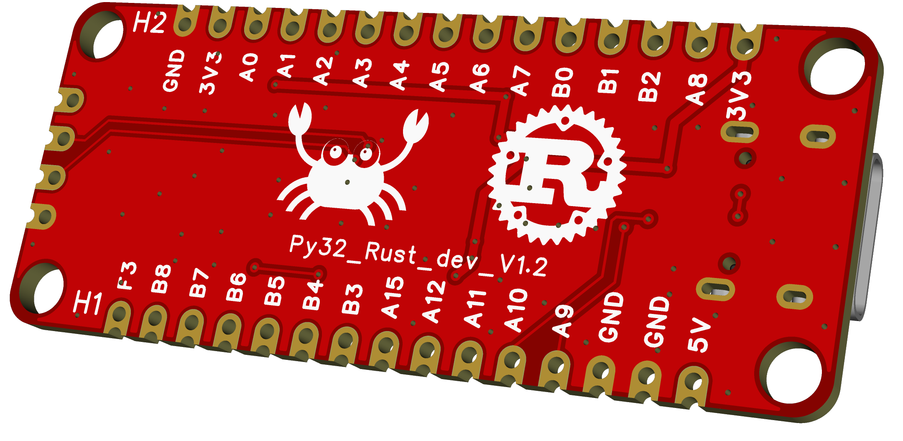
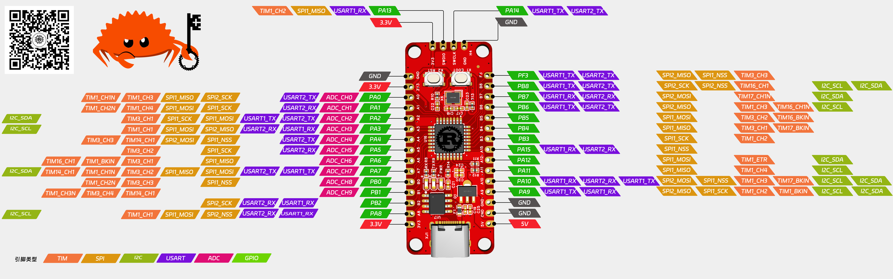

# Py32F030_CrabBoard_Hardware

## 💁 Overview
This repository stores the hardware information of the Py32F030Rust development board.
- [Datasheet](https://www.puyasemi.com/download_path/%E6%95%B0%E6%8D%AE%E6%89%8B%E5%86%8C/MCU%20%E5%BE%AE%E5%A4%84%E7%90%86%E5%99%A8/PY32F030_Datasheet_V2.3.pdf)
- [Software drivers and examples](https://github.com/hysonglet/py32f030-hal)
- TOP View

- Botton View 

- Pin map

- [Schematic diagram](./SCH_Py32F030_Rust_board_V20.pdf)
- [PCB](./PCB_Py32F030_Rust_board_V20.pdf)
- [3D](./3D_Py32F030_Rust_board_V20.step)
- size: 51*21mm
- Wechat blog
